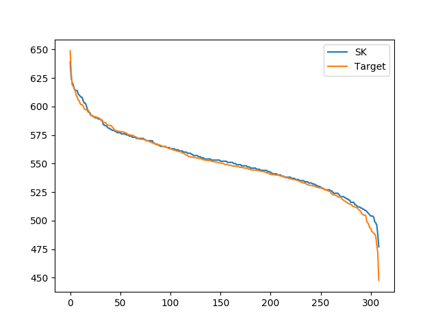

# SeLaVi: Labelling unlabelled videos from scratch with multi-modal self-supervision
This code provides a PyTorch implementation and pretrained models for **SeLaVi** (Labelling unlabelled videos from scratch with multi-modal self-supervision), as described in the paper [Labelling unlabelled videos from scratch with multi-modal self-supervision](https://arxiv.org/abs/2006.13662).

<div align="center">
  
</div>

SeLaVi is an efficient and simple method for learning labels of multi-modal audio-visual data.

# Key contributions

**(1) Clustering does not come for free**

Even very strong feature representations such as a supervisedly pretrained R(2+1)D-18 or MIL-NCE S3D network underperform our method that _learns_ clusters.

**(2) Truly multi-modal clustering yields robust clusters**

Since our method treats each modality as an _augmentation_ from another, our method learn to give stable predictions even if one modality is degraded.

# Model Zoo
We provide serveral baseline SeLaVi pre-trained models with R(2+1)-D-18 video and Resnet-9 audio architecture in torchvision format in different datasets.

| Method | Dataset        | Clusters | Setting   | Heads | NMI   | Accuracy | url                                                                          |
|--------|----------------|----------|-----------|-------|-------|----------|------------------------------------------------------------------------------|
| SeLaVi | AVE            | 28       | MA, G, MH | 10    | 66.1% | 58.0%    | [model](https://dl.fbaipublicfiles.com/selavi/selavi_ave_150.pth)            |
| SeLaVi | Kinetics-Sound | 32       | MA, G, MH | 10    | 49.6% | 44.1%    | [model](https://dl.fbaipublicfiles.com/selavi/selavi_kinetics_sound_150.pth) |
| SeLaVi | Kinetics       | 400      | MA, G, MH | 10    | 25.3% | 7.1%     | [model](https://dl.fbaipublicfiles.com/selavi/selavi_kinetics_45.pth)        |
| SeLaVi | VGG-Sound      | 309      | MA, G, MH | 10    | 54.6% | 30.9%    | [model](https://dl.fbaipublicfiles.com/selavi/selavi_vgg_sound_150.pth)      |

MA = Modality Alignment, G = Gaussian Marginals, DH = Decorrelated Heads (see paper for details)

## Further details for the VGG-Sound trained model

| Model            | NMI   | aNMI  | aRI   | Accuracy | Purity | HMDB-51 (3-fold) | UCF-101 (3-fold) |
|------------------|-------|-------|-------|----------|--------|------------------|------------------|
| SeLaVi VGG-Sound | 54.6% | 52.0% | 20.6% | 30.9%    | 36.2%  |  55.1% (55.4, 54.8, 55.1)         | 86.1% (86.0, 85.9, 86.5)            |


## Download and or visualize clusters:

You can download the csv files for our clusters here: [VGG-Sound](https://www.robots.ox.ac.uk/~vgg/research/selavi/data/vgg_sound_clusters.csv), [Kinetics](https://www.robots.ox.ac.uk/~vgg/research/selavi/data/kinetics_clusters.csv). Note: as everywhere in the paper, we're only taking a single crop in space and time for generating these. 

SeLaVi is an efficient and simple method for learning labels of multi-modal audio-visual data. 
To interactively visualize the clusters we obtain for Kinetics and VGG-Sound, as we do on our [homepage](https://www.robots.ox.ac.uk/~vgg/research/selavi/#demo), run:
```
python3 cluster_vis/get_clusters_vggsounds.py --ckpt_path ${VGG_SOUND_CKPT_PATH};
python3 cluster_vis/get_clusters_kinetics.py --ckpt_path ${KINETICS_CKPT_PATH};
cd cluster_vis;
python3 preprocess.py --kinetics_path selavi_kinetics.pkl --vgg_sound_path selavi_vgg_sounds.pkl

# open index.html in your browser 
```

# Running SeLaVi unsupervised training

## Installation

This repo was tested with Ubuntu 16.04.5 LTS, Python 3.7.5, PyTorch 1.3.1, Torchvision 0.4.1, and CUDA 10.0.

1. Install required packages using `conda env create -f environment.yml`

2. Activate conda environment using `conda activate lab_vid`

3. Ensure pre-training datasets (VGG-Sound, Kinetics, AVE) are pre-processed such that the folder structure is in the form: 
```
{dataset_name}/{train,val,test}/{class_name}/{video_name}.mp4
```
N.B. Kinetics-Sound is a subset of Kinetics. 

## Single-node training
SeLaVi is very simple to implement and experiment with.
Our implementation consists of a [main.py](./main.py) file from which the following are imported: the dataset definition [dataset/AVideoDataset.py](./dataset/AVideoDataset.py), the model architecture [model.py](model.py), Sinkhorn-knopp algorithm [src/sk_utils.py](src/sk_utils.py), and some miscellaneous training utilities [utils.py](utils.py).

For example, to train SeLaVi baseline on a single node with 8 gpus for 200 epochs on VGG-Sound, run:
```
python -m torch.distributed.launch --nproc_per_node=8 main.py \
--root_dir /path/to/VGGSound \
--epochs 200 \
--batch_size 16 \
--base_lr 1e-2 \
--ds_name vgg_sound \
--use_mlp True \
--mlp_dim 309 \
--headcount 10 \
--match True \
--distribution gauss \
--ind_groups 2 
```

## Multi-node training
Distributed training is available via Slurm. We provide a customizable [SBATCH script](./scripts/master.sh) to reproduce our SeLaVi models.
For example, to train SeLaVi on 8 nodes and 64 GPUs with a batch size of 1024 for 200 epochs run:
```
sbatch ./scripts/master.sh
```
Note that you might need to remove the copyright header from the sbatch file to launch it.

**Set up `dist_url` parameter**: We refer the user to pytorch distributed documentation ([env](https://pytorch.org/docs/stable/distributed.html#environment-variable-initialization) or [file](https://pytorch.org/docs/stable/distributed.html#shared-file-system-initialization) or [tcp](https://pytorch.org/docs/stable/distributed.html#tcp-initialization)) for setting the distributed initialization method (parameter `dist_url`) correctly. In the provided sbatch files, we use the [tcp init method](https://pytorch.org/docs/stable/distributed.html#tcp-initialization) (see [\*](https://github.com/facebookresearch/swav/blob/master/scripts/swav_800ep_pretrain.sh#L17-L20) for example).

# Evaluating models

## Evaluate models: Clustering quality
To evaluate the clustering quality of SeLaVi pretraining:
```
python3 get_clusters.py \
--dataset {vggsound, kinetics, ave, kinetics_sound} 
--root_dir /path/to/dataset \
--weights_path ${WEIGHTS_PATH} \
--output_dir ${OUTPUT_DIR} \
--exp_desc ${EXP_DESC} \
--mode train \
--headcount ${HEADCOUNT}

python3 clustering_metircs.py \
--path ${OUTPUT_DIR}/${EXP_DESC}.pkl \
--ncentroids ${NUM_CLS} 

# Set NUM_CLS={kinetics: 400, ave: 28, vggsound: 309, kinetics_sounds: 32}
```

## Evaluate models: Video Action Recognition
To evaluate SeLaVi pretraining on video action recognition:
```
python3 finetune_video.py \
--dataset {ucf101, hmdb51} \
--root_dir /path/to/dataset \
--fold {1,2,3} \
--batch_size 32 \
--workers 10 \
--weights_path ${WEIGHTS_PATH} \
--output_dir ${OUTPUT_DIR} \
--num_clusters ${NUM_CLUSTERS} 
```

## Evaluate models: Video Retrieval
To evaluate SeLaVi pretraining on video action retrieval:
```
python3 video_retrieval.py \
--dataset {ucf101, hmdb51} \
--root_dir /path/to/dataset \
--fold {1,2,3} \
--batch_size 32 \
--workers 10 \
--weights_path ${WEIGHTS_PATH} \
--output_dir ${OUTPUT_DIR}
```

## Visualize output distributions
To evaluate SeLaVi pretraining on video action retrieval:
```
python3 plot_distributions.py
```

Uniform           |  Gaussian
:-------------------------:|:-------------------------:
  |  

# Citation
If you find this repository useful in your research, please cite:
```
@inproceedings{asano2020labelling,
      title={Labelling unlabelled videos from scratch with multi-modal self-supervision}, 
      author={Yuki M. Asano and Mandela Patrick and Christian Rupprecht and Andrea Vedaldi},
      year={2020},
      booktitle={NeurIPS}
}
```
